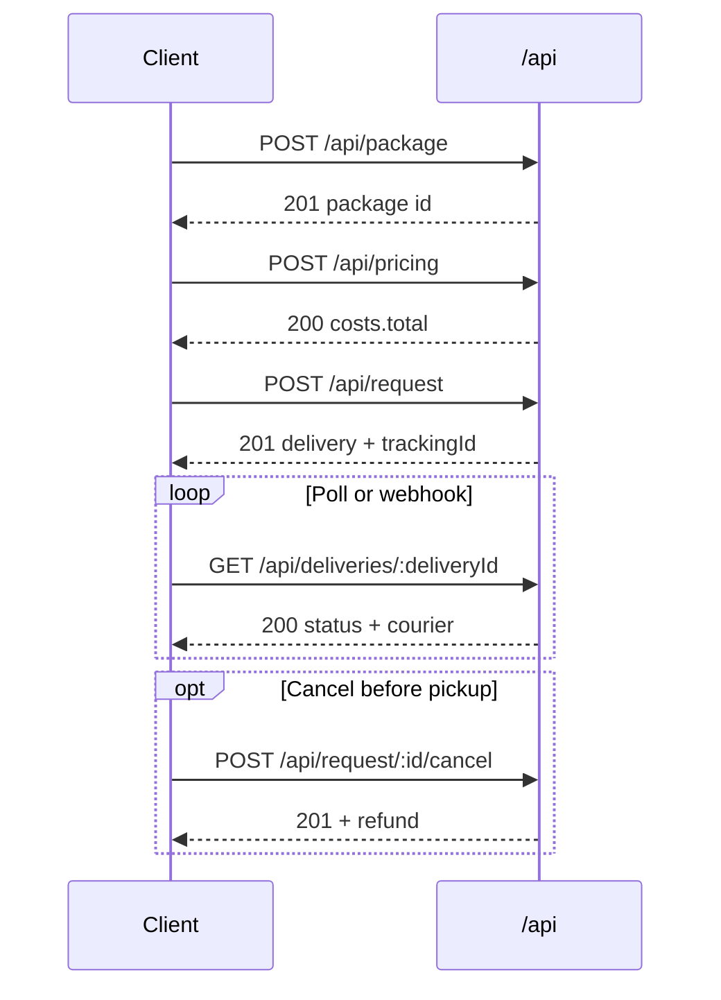

# API module

Base path: **`/api`** (no global API prefix). Hosts: staging **`https://staging-api.waysdrop.com`**, live **`https://api.waysdrop.com`**.

All routes use **`ApiKeyAuthGuard`** — **API key only** (JWT is not accepted on this controller).

Controller: `src/api/api.controller.ts` · Service: `src/api/api.service.ts`

---

## Authentication

| Header    | Value                                         |
| --------- | --------------------------------------------- |
| `api-key` | `wsp_live_<64 hex>` or `wsp_staging_<64 hex>` |

The key must match: `^wsp_(live|staging)_[a-f0-9]{64}$`

The authenticated user is the **API key owner**. Quota and billing are enforced per key.

Keys with **`serverOnly: true`** (default) reject browser-originated requests. Set `serverOnly: false` on the key to allow client-side usage.

### Errors

| Status | When                                                                |
| ------ | ------------------------------------------------------------------- |
| `401`  | Missing key, invalid format, or validation failed                   |
| `403`  | Key disabled, IP restrictions, or browser blocked when `serverOnly` |
| `429`  | Quota exceeded (`message` may include `quota` object)               |

### Account requirements (delivery flows)

| Requirement                                                            | Used by                                      |
| ---------------------------------------------------------------------- | -------------------------------------------- |
| **Personal profile** on the key owner                                  | `POST /api/request` (author profile for P2P) |
| **Merchant wallet** (`WalletChannel.MERCHANT`) with sufficient balance | `POST /api/request` (wallet debit)           |
| Packages owned by the key owner, not yet assigned to a delivery        | `POST /api/request`, package endpoints       |

---

## Response envelopes

### Success (JSON body)

```json
{
  "success": true,
  "message": "<human-readable message>",
  "data": <payload>
}
```

### Success (no body)

**`204 No Content`** — empty body (`DELETE /api/package/:packageId`).

### Errors

```json
{
    "statusCode": 400,
    "method": "POST",
    "timestamp": "2026-05-15T12:00:00.000Z",
    "path": "/api/request",
    "url": "https://api.example.com/api/request",
    "message": "Insufficient balance",
    "details": { "error": "Unprocessable Entity", "statusCode": 422 },
    "environment": "production"
}
```

Validation errors: `message` is a single string with fields joined by `; `.

---

## Money overrides (optional)

Several endpoints accept optional currency overrides aligned with consumer APIs:

| Param           | Location     | Purpose                                                                                                                                                                                                          |
| --------------- | ------------ | ---------------------------------------------------------------------------------------------------------------------------------------------------------------------------------------------------------------- |
| `inputCurrency` | Request body | ISO 4217 currency of numeric **input** fields (`value`, `totalValue`, …). When omitted, the key owner's corridor default applies. Persisted rows store USD catalog `value`/`totalValue` plus FX snapshot fields. |
| `currency`      | Query string | ISO 4217 **display-only** override for `*Display` fields on responses. Does not change stored ledger/catalog amounts.                                                                                            |

Example — declare package value in GHS but render list prices in NGN:

```http
POST /api/package?currency=NGN
Content-Type: application/json

{
  "name": "Parcel",
  "quantity": 1,
  "value": 500,
  "inputCurrency": "GHS",
  "size": "SMALL"
}
```

Response `data.value` remains USD catalog; `data.valueDisplay.local.currency` follows `?currency=`.

See [Money & currencies](/get-started/money-and-currencies).

---

## Money model (catalog vs wallet)

Waysdrop uses **two money layers**. Do not treat wallet balance as USD.

| Layer                | What it covers                                                                  | Stored as                                                  | API examples                                                             |
| -------------------- | ------------------------------------------------------------------------------- | ---------------------------------------------------------- | ------------------------------------------------------------------------ |
| **Catalog / ledger** | Package `value`, pricing `costs.*`, delivery `totalValue`, transaction `amount` | **USD** (plus FX snapshot fields when the row was written) | `"value": "3.33"`, `"costs": { "total": "4.75" }`                        |
| **Native wallet**    | `Wallet.balance`, wallet debits/credits, checkout `charge_amount`               | **Wallet `currencyCode`** (e.g. NGN, GHS)                  | Merchant wallet ₦172,500; checkout charges customer in corridor currency |

**Writes:** send human amounts with optional `inputCurrency` — the server persists USD catalog + snapshot.

**Reads:** raw numeric fields stay USD catalog; pass `?currency=NGN` (or body `currency` on POST) for optional `*Display` local formatting. Display overrides do **not** change checkout processor or wallet debit currency.

**Checkout (`paymentMethodType: "CHECKOUT"`):** processor and `charge_currency` are chosen from the **collection corridor** (merchant phone → delivery destination → merchant country), not from `?currency=`. Response includes `processor` (`PAYSTACK` \| `NOMBA` \| `STRIPE`), `charge_currency`, `charge_amount`, and `authorization_url` / `checkout_url`.

**Wallet (`paymentMethodType: "WALLET"`):** debits your **merchant wallet** in its native currency; USD catalog amount is converted at debit time when needed.

See [Money & currencies](/get-started/money-and-currencies).

---

## Endpoints overview

| #   | Method   | Path                              | Purpose                                             |
| --- | -------- | --------------------------------- | --------------------------------------------------- |
| 1   | `GET`    | `/api/countries`                  | Country location catalog                            |
| 2   | `GET`    | `/api/states`                     | State location catalog                              |
| 3   | `GET`    | `/api/cities`                     | City/LGA location catalog                           |
| 4   | `POST`   | `/api/route`                      | Resolve route distance & type                       |
| 5   | `GET`    | `/api/fleet-types`                | List active fleet types                             |
| 6   | `POST`   | `/api/pricing`                    | Estimate delivery cost                              |
| 7   | `POST`   | `/api/package`                    | Create or edit a package                            |
| 8   | `DELETE` | `/api/package/:packageId`         | Delete an unassigned package                        |
| 9   | `GET`    | `/api/packages`                   | List unassigned packages                            |
| 10  | `POST`   | `/api/request`                    | Create P2P delivery (wallet or hosted checkout)     |
| 11  | `POST`   | `/api/request/:deliveryId/cancel` | Cancel eligible delivery                            |
| 12  | `GET`    | `/api/deliveries`                 | List deliveries for the current API key             |
| 13  | `GET`    | `/api/deliveries/:deliveryId`     | Get delivery details & tracking                     |
| 14  | `GET`    | `/api/wallet`                     | Merchant wallet balance (native currency)           |
| 15  | `POST`   | `/api/payments/checkout`          | Collect payment from a customer via hosted checkout |
| 16  | `GET`    | `/api/account`                    | Corridor currency & store profile summary           |
| 17  | `GET`    | `/api/exchange-rate`              | FX rate between two ISO 4217 codes                  |
| 18  | `GET`    | `/api/convert`                    | Convert amount between two currencies               |

---

## 1. Fetch countries

**`GET /api/countries`**

### Query params

| Param    | Type   | Required | Description                   |
| -------- | ------ | -------- | ----------------------------- |
| `search` | string | No       | Filter catalog by search text |

### Success — `200 OK`

`data` is an array of **route location options** (`RouteType.INTER_COUNTRY`): each item includes `value`, `name`, `type`, `country`, `countryCode`, `continentCode`, etc.

### Sample

```json
{
    "success": true,
    "message": "Countries fetched successfully",
    "data": [
        {
            "value": "NG",
            "name": "Nigeria",
            "type": "INTER_COUNTRY",
            "country": "Nigeria",
            "countryCode": "NG",
            "countryCodeAlpha3": "NGA",
            "continentCode": "AF",
            "continentName": "Africa"
        }
    ]
}
```

---

## 2. Fetch states

**`GET /api/states`**

### Query params

| Param    | Type   | Required | Description    |
| -------- | ------ | -------- | -------------- |
| `search` | string | No       | Filter catalog |

### Success — `200 OK`

`data` is an array of **`INTER_STATE`** options (`value`, `name`, `state`, `country`, `countryCode`, …).

### Sample

```json
{
    "success": true,
    "message": "States fetched successfully",
    "data": [
        {
            "value": "ng-admin1-lagos",
            "name": "Lagos",
            "type": "INTER_STATE",
            "state": "Lagos",
            "country": "Nigeria",
            "countryCode": "NG",
            "admin1Id": "ng-admin1-lagos",
            "admin1Name": "Lagos"
        }
    ]
}
```

---

## 3. Fetch cities

**`GET /api/cities`**

### Query params

| Param    | Type   | Required | Description                       |
| -------- | ------ | -------- | --------------------------------- |
| `search` | string | No       | Filter indexed city/LGA locations |

### Success — `200 OK`

`data` is an array of **system locations** with a `value` field (`googlePlaceId` or `locationId`), plus `country`, `countryCode`, `lat`, `lon`, `lgaOrCity`, `state`, etc.

### Sample

```json
{
    "success": true,
    "message": "Cities fetched successfully",
    "data": [
        {
            "locationId": "ng-lagos-ikeja",
            "value": "ChIJxxxxxxxx",
            "country": "Nigeria",
            "countryCode": "NG",
            "lat": 6.6018,
            "lon": 3.3515,
            "lgaOrCity": "Ikeja",
            "state": "Lagos",
            "adminUnitName": "Ikeja"
        }
    ]
}
```

---

## 4. Get route data

**`POST /api/route`**

Resolves geocoded origin/destination, driving distance, ETA, and route type.

### Request body

| Field         | Type   | Required | Description                       |
| ------------- | ------ | -------- | --------------------------------- |
| `origin`      | string | Yes      | Free-text address (max 255 chars) |
| `destination` | string | Yes      | Free-text address (max 255 chars) |

```json
{
    "origin": "Ladipo Kuku Street, Ikeja Lagos",
    "destination": "Adewole Estate, Surulere Lagos"
}
```

### Success — `200 OK`

| Field                 | Type        | Description                           |
| --------------------- | ----------- | ------------------------------------- |
| `distance.distanceKm` | number      | Road/line max distance (km)           |
| `distance.etaSeconds` | number      | Estimated time (seconds)              |
| `routeType`           | `RouteType` | e.g. `INTER_CITY`, `INTER_STATE`      |
| `origin`              | object      | Resolved `GLocation` / address fields |
| `destination`         | object      | Resolved `GLocation` / address fields |

### Sample

```json
{
    "success": true,
    "message": "Route data fetched successfully",
    "data": {
        "distance": {
            "distanceKm": 18.4,
            "etaSeconds": 2400
        },
        "routeType": "INTER_CITY",
        "origin": {
            "addressLine1": "Ladipo Kuku Street, Ikeja Lagos",
            "lgaOrCity": "Ikeja",
            "state": "Lagos",
            "country": "Nigeria",
            "countryCode": "NG",
            "lat": 6.6018,
            "lon": 3.3515,
            "googlePlaceId": "ChIJorigin"
        },
        "destination": {
            "addressLine1": "Adewole Estate, Surulere Lagos",
            "lgaOrCity": "Surulere",
            "state": "Lagos",
            "country": "Nigeria",
            "countryCode": "NG",
            "lat": 6.4969,
            "lon": 3.3539,
            "googlePlaceId": "ChIJdest"
        }
    }
}
```

---

## 5. Fetch fleet types

**`GET /api/fleet-types`**

No query or body parameters.

### Success — `200 OK`

`data` is an array of active fleet types:

| Field         | Type           | Description     |
| ------------- | -------------- | --------------- |
| `id`          | UUID           | Fleet type ID   |
| `name`        | string         | Display name    |
| `icon`        | string \| null | Icon URL or key |
| `description` | string \| null | Description     |

### Sample

```json
{
    "success": true,
    "message": "Fleet types fetched successfully",
    "data": [
        {
            "id": "fleet-uuid-1",
            "name": "Bike",
            "icon": "https://cdn.waysdrop.com/icons/bike.svg",
            "description": "Light parcels"
        },
        {
            "id": "fleet-uuid-2",
            "name": "Van",
            "icon": "https://cdn.waysdrop.com/icons/van.svg",
            "description": "Medium to large parcels"
        }
    ]
}
```

Fleet choice for pricing/request: if `fleetTypeId` is omitted, the server picks the **best-fit** recommended fleet for the total package weight (all active fleets are scored; `[0]` is used). An explicit active `fleetTypeId` is honored even if it is not the best fit.

---

## 6. Get pricing

**`POST /api/pricing`**

Estimates delivery cost before creating a request. Uses the same pricing engine as delivery creation. `costs.insurance` is always `0`.

### Request body

Extends route fields with shipment details:

| Field              | Type   | Required       | Description                                                                         |
| ------------------ | ------ | -------------- | ----------------------------------------------------------------------------------- |
| `origin`           | string | Yes            | Address text                                                                        |
| `destination`      | string | Yes            | Address text                                                                        |
| `totalWeight`      | number | Yes            | Total weight (kg)                                                                   |
| `totalValue`       | number | Yes            | Declared value (currency units; use with `inputCurrency` when not corridor default) |
| `inputCurrency`    | string | No             | ISO 4217 currency of `totalValue` (body write override)                             |
| `currency`         | string | No (query)     | ISO 4217 display override for cost `*Display` fields on the response                |
| `urgencyType`      | enum   | No             | `PRIORITY`, `STANDARD`, `SCHEDULED`                                                 |
| `slot`             | string | If `SCHEDULED` | Delivery slot in **origin local time**, e.g. `"10:00 - 13:00"`                      |
| `fleetTypeId`      | UUID   | No             | Preferred fleet; omitted → best-fit recommended fleet                               |
| `courierProfileId` | UUID   | No             | If set, may apply courier-specific route pricing when matched                       |

```json
{
    "origin": "Ladipo Kuku Street, Ikeja Lagos",
    "destination": "Adewole Estate, Surulere Lagos",
    "totalWeight": 5,
    "totalValue": 25000,
    "urgencyType": "STANDARD",
    "fleetTypeId": "fleet-uuid-1"
}
```

### Scheduled pricing sample

```json
{
    "origin": "Ikeja, Lagos",
    "destination": "Lekki, Lagos",
    "totalWeight": 3,
    "totalValue": 10000,
    "urgencyType": "SCHEDULED",
    "slot": "10:00 - 13:00"
}
```

### Success — `200 OK`

| Field                    | Type           | Description                                                    |
| ------------------------ | -------------- | -------------------------------------------------------------- |
| `distance`               | object         | `{ distanceKm, etaSeconds }`                                   |
| `routeType`              | `RouteType`    | Route classification                                           |
| `costs.base`             | string/number  | Base distance charge (Decimal)                                 |
| `costs.weight`           | string/number  | Weight surcharge                                               |
| `costs.fleet`            | string/number  | Fleet surcharge                                                |
| `costs.insurance`        | string/number  | `0` for API estimates                                          |
| `costs.surcharge`        | string/number  | Slot/condition surcharges                                      |
| `costs.serviceFee`       | string/number  | Platform service fee on declared value                         |
| `costs.deliverySubtotal` | string/number  | Subtotal before service fee                                    |
| `costs.total`            | string/number  | **Amount charged** (min ₦1,500 total before service fee logic) |
| `breakdown`              | object         | Human-readable charge lines (nullable fields)                  |
| `courierPricingRule`     | object \| null | Set when courier route rule applies                            |

### Sample — standard

```json
{
    "success": true,
    "message": "Pricing fetched successfully",
    "data": {
        "distance": { "distanceKm": 18.4, "etaSeconds": 2400 },
        "routeType": "INTER_CITY",
        "costs": {
            "base": "3200",
            "weight": "500",
            "fleet": "800",
            "insurance": "0",
            "surcharge": "0",
            "serviceFee": "250",
            "deliverySubtotal": "4500",
            "total": "4750"
        },
        "breakdown": {
            "baseCharge": "Base distance charge for 18.40km",
            "weightCharge": "Additional charge for 5kg",
            "insuranceCharge": null,
            "fleetCharge": "Fleet charge for Bike delivery",
            "surchargeCharge": null,
            "serviceFeeCharge": "Platform service fee"
        },
        "courierPricingRule": null
    }
}
```

### Errors

| Status | Message (examples)                       |
| ------ | ---------------------------------------- |
| `404`  | Fleet type not found                     |
| `400`  | No fleet type found for the given weight |
| `400`  | Unable to determine distance             |

---

## 7. Create or edit package

**`POST /api/package`**

### Request body — create

| Field           | Type           | Required | Description                                                                        |
| --------------- | -------------- | -------- | ---------------------------------------------------------------------------------- |
| `name`          | string         | Yes      | Package name                                                                       |
| `quantity`      | integer        | Yes      | Item count                                                                         |
| `value`         | number         | Yes      | Declared value (native units; pair with `inputCurrency` when not corridor default) |
| `inputCurrency` | string         | No       | ISO 4217 currency of `value` on create/edit                                        |
| `currency`      | string (query) | No       | ISO 4217 display override for `valueDisplay` on the response                       |
| `size`          | enum           | Yes      | `SMALL` (≈2 kg), `MEDIUM` (≈7 kg), `LARGE` (≈15 kg)                                |
| `packageType`   | string         | No       | Category label                                                                     |
| `description`   | string         | No       | Max 128 chars                                                                      |
| `image`         | string (URL)   | No       | HTTPS URL; host must be `cdn.waysdrop.com`                                         |

```json
{
    "name": "Electronics box",
    "quantity": 1,
    "value": 50000,
    "size": "MEDIUM",
    "packageType": "Electronics",
    "description": "Fragile",
    "image": "https://cdn.waysdrop.com/uploads/pkg.jpg"
}
```

### Request body — edit

| Field       | Type | Required | Description                                        |
| ----------- | ---- | -------- | -------------------------------------------------- |
| `packageId` | UUID | Yes      | Existing package ID                                |
| _(others)_  |      | No       | Any updatable fields (`name`, `value`, `image`, …) |

```json
{
    "packageId": "pkg-uuid-here",
    "value": 55000,
    "description": "Updated note"
}
```

Cannot edit a package already linked to a delivery (`400`).

### Success — `201 Created`

`data` is the full `DeliveryPackage` row (`id`, `name`, `weight`, `value`, `size`, `quantity`, FX snapshot fields when value was set, optional `valueDisplay` when `?currency=` is passed, …). `weight` is derived from `size` on create. **`value` is USD catalog**; native input is preserved on `inputCurrencyCode` / `inputAmount`.

### Sample — created

```json
{
    "success": true,
    "message": "Package saved successfully",
    "data": {
        "id": "pkg-uuid-1",
        "name": "Electronics box",
        "packageType": "Electronics",
        "image": "https://cdn.waysdrop.com/uploads/pkg.jpg",
        "description": "Fragile",
        "quantity": 1,
        "weight": "7",
        "value": "50000",
        "size": "MEDIUM",
        "type": "PACKAGE_ITEM",
        "p2pDeliveryId": null,
        "userId": "user-uuid",
        "createdAt": "2026-05-15T10:00:00.000Z",
        "updatedAt": "2026-05-15T10:00:00.000Z",
        "deletedAt": null
    }
}
```

---

## 8. Delete package

**`DELETE /api/package/:packageId`**

### Path params

| Param       | Type | Description       |
| ----------- | ---- | ----------------- |
| `packageId` | UUID | Package to delete |

### Success — `204 No Content`

No body.

### Errors

| Status | Message                         |
| ------ | ------------------------------- |
| `404`  | Package not found               |
| `400`  | Package is already in a request |

---

## 9. List packages

**`GET /api/packages`**

Returns packages for the API key owner that are **not** attached to any P2P delivery.

Optional query: `?currency=NGN` (or any supported ISO 4217 code) to override `valueDisplay` on each row.

### Success — `200 OK`

`data` is an array of `DeliveryPackage` records (plus optional `valueDisplay`), newest first.

### Sample — with packages

```json
{
    "success": true,
    "message": "Packages retrieved successfully",
    "data": [
        {
            "id": "pkg-uuid-1",
            "name": "Electronics box",
            "weight": "7",
            "value": "50000",
            "size": "MEDIUM",
            "quantity": 1,
            "p2pDeliveryId": null
        }
    ]
}
```

### Sample — empty

```json
{
    "success": true,
    "message": "Packages retrieved successfully",
    "data": []
}
```

---

## 10. Create delivery request

**`POST /api/request`**

Creates a **P2P** delivery and collects any upfront creator share via **merchant wallet** or **hosted checkout**. Supports the same payment flags as the partner integration (`deliveryFeePayer`, `payPackageValue`, `payOnDelivery`, …).

Optional query: `?currency=NGN` — display-only override for `*Display` fields on the response (does not change checkout processor or charge currency).

### Request body

| Field                        | Type        | Required       | Description                                                                        |
| ---------------------------- | ----------- | -------------- | ---------------------------------------------------------------------------------- |
| `origin`                     | string      | Yes            | Pickup address (max 255)                                                           |
| `destination`                | string      | Yes            | Drop-off address (max 255)                                                         |
| `packagesId`                 | UUID[]      | Yes            | Unassigned package IDs (must all belong to user)                                   |
| `type`                       | enum        | Yes            | `PICKUP` or `DROP_OFF`                                                             |
| `courierSelection`           | enum        | Yes            | `ANYONE`, `SPECIFIC`, `MERCHANT_SPECIAL_COURIERS`                                  |
| `courierId`                  | UUID        | If `SPECIFIC`  | Courier profile ID                                                                 |
| `destinationContactName`     | string      | Yes            | Recipient name                                                                     |
| `destinationContactEmail`    | string      | Yes            | Recipient email                                                                    |
| `destinationContactPhone`    | string      | Yes            | E.164 phone                                                                        |
| `originContactName`          | string      | No             | Defaults to API user fullname                                                      |
| `originContactEmail`         | string      | No             | Defaults to API user email                                                         |
| `originContactPhone`         | string      | No             | Defaults to API user phone                                                         |
| `note`                       | string      | No             | Delivery notes (max 128)                                                           |
| `urgencyType`                | enum        | No             | `PRIORITY`, `STANDARD`, `SCHEDULED`                                                |
| `deliveryDate`               | date string | If `SCHEDULED` | e.g. `"2025-06-01"`                                                                |
| `deliverySlot`               | string      | If `SCHEDULED` | Valid slot for date                                                                |
| `fleetTypeId`                | UUID        | No             | Auto-selected best-fit fleet if omitted                                            |
| `deliveryFeePayer`           | enum        | No             | `CREATOR` (default), `RECIPIENT`, `SPLIT`                                          |
| `paymentMethodType`          | enum        | No             | `WALLET` (default) or `CHECKOUT`                                                   |
| `callbackUrl`                | string      | No             | Post-payment redirect when using `CHECKOUT` (allowed origin; server appends `ref`) |
| `payPackageValue`            | boolean     | No             | Charge declared package value upfront with creator share                           |
| `payOnDelivery`              | boolean     | No             | Collect package value at door (mutually exclusive with `payPackageValue`)          |
| `podRemitTo`                 | enum        | If POD         | `MY_WALLET` or `COURIER_WALLET`                                                    |
| `currency`                   | string      | No (body)      | Display-only override (same as `?currency=`)                                       |
| `requireCollectionProofCode` | boolean     | No             | Default `true`                                                                     |
| `requireDeliveryProofCode`   | boolean     | No             | Default `true`                                                                     |
| `link3rdPartyByContactInfo`  | boolean     | No             | Default `false`                                                                    |

**Courier selection notes:**

- `MERCHANT_SPECIAL_COURIERS` — user must have at least one merchant-specific courier (`404` if empty). Use merchant dashboard / `docs/merchant-api.md` to manage the list.
- `SPECIFIC` — courier must exist, type `Courier`, and not be `SUSPENDED`.

**Scheduling:** `deliveryDate` and `deliverySlot` must be paired. When both are sent, the server auto-sets `urgencyType` to `SCHEDULED` if omitted. Slots use origin local timezone (address timezone → country geo lookup → `APP_TIME_ZONE` → `Africa/Lagos`), require at least a one-hour window, and cannot be expired. Quote/cost requests include time surcharges when `slot` is provided for `SCHEDULED` deliveries.

**Payment:**

| `paymentMethodType` | Behaviour                                                                                                                                                                                                                                                                                                |
| ------------------- | -------------------------------------------------------------------------------------------------------------------------------------------------------------------------------------------------------------------------------------------------------------------------------------------------------- |
| `WALLET` (default)  | Debits **merchant wallet** in native wallet currency when you owe an upfront creator share. `422` if insufficient balance.                                                                                                                                                                               |
| `CHECKOUT`          | Returns hosted checkout fields when you owe an upfront share. Redirect using `authorization_url` or `checkout_url`. Optional `callbackUrl` controls the post-payment redirect (allowed origins only; server appends `ref=<reference>`). Matching for paid flows starts after payment confirms (webhook). |

When `deliveryFeePayer` is `RECIPIENT` or `SPLIT`, the customer may receive their own checkout link (`deliveryFee.recipient.checkoutUrl`). Courier matching starts only when `matchingEligible: true`.

Full flag matrix: [PARTNER_API_INTEGRATION.md](./partner/PARTNER_API_INTEGRATION.md#payment-flags-reference).

### Sample — standard request

```json
{
    "origin": "12 Allen Avenue, Ikeja, Lagos",
    "destination": "45 Admiralty Way, Lekki, Lagos",
    "packagesId": ["pkg-uuid-1", "pkg-uuid-2"],
    "type": "PICKUP",
    "courierSelection": "ANYONE",
    "destinationContactName": "Jane Recipient",
    "destinationContactEmail": "jane@example.com",
    "destinationContactPhone": "+2348012345678",
    "note": "Call on arrival",
    "urgencyType": "STANDARD",
    "requireCollectionProofCode": true,
    "requireDeliveryProofCode": true
}
```

### Sample — specific courier

```json
{
    "origin": "12 Allen Avenue, Ikeja, Lagos",
    "destination": "45 Admiralty Way, Lekki, Lagos",
    "packagesId": ["pkg-uuid-1"],
    "type": "DROP_OFF",
    "courierSelection": "SPECIFIC",
    "courierId": "787db687-d0d9-425a-955e-aa52d6572da9",
    "destinationContactName": "Jane Recipient",
    "destinationContactEmail": "jane@example.com",
    "destinationContactPhone": "+2348012345678"
}
```

### Sample — scheduled

```json
{
    "origin": "Ikeja, Lagos",
    "destination": "Abuja, FCT",
    "packagesId": ["pkg-uuid-1"],
    "type": "PICKUP",
    "courierSelection": "ANYONE",
    "urgencyType": "SCHEDULED",
    "deliveryDate": "2026-06-01",
    "deliverySlot": "10:00 - 13:00",
    "destinationContactName": "Jane Recipient",
    "destinationContactEmail": "jane@example.com",
    "destinationContactPhone": "+2348012345678"
}
```

### Success — `201 Created`

`data` shape depends on payment path:

| Path                                | Top-level fields                                                                                                                                                                   |
| ----------------------------------- | ---------------------------------------------------------------------------------------------------------------------------------------------------------------------------------- |
| **`WALLET`** (creator share paid)   | P2P/delivery record (`id`, `deliveryId`, nested `delivery`, `totalValue`, …) plus `deliveryFee` responsibility block                                                               |
| **`CHECKOUT`** (creator share owed) | Hosted checkout: `processor`, `charge_currency`, `charge_amount`, `amount_usd`, `reference`, `authorization_url` / `checkout_url`, plus `deliveryFee` / `payPackageValue` metadata |

When `?currency=` is passed, USD catalog fields also include optional `*Display` companions (e.g. `totalValueDisplay`, `deliveryFee.creator.amountDisplay`).

**Checkout processor selection:** corridor-based — Nigeria → Paystack or Nomba (env), other supported countries → Stripe (local currency or USD fallback). Not chosen by the merchant in the request body.

Key fields on nested `delivery` (when present):

| Field                      | Description                          |
| -------------------------- | ------------------------------------ |
| `id`                       | Delivery UUID (use for cancel & get) |
| `trackingId`               | Public tracking code                 |
| `status`                   | Initially `REQUEST_CREATED`          |
| `deliveryFee`              | Total charged (Decimal string)       |
| `distanceKm`, `etaSeconds` | From route calculation               |
| `courierMatching`          | Echo of `courierSelection`           |

Nested `p2pDelivery`:

| Field                       | Description              |
| --------------------------- | ------------------------ |
| `id`                        | P2P record ID            |
| `status`                    | `PENDING`                |
| `type`                      | `PICKUP` / `DROP_OFF`    |
| `totalWeight`, `totalValue` | Aggregated from packages |

### Sample — created

```json
{
    "success": true,
    "message": "Delivery request created successfully",
    "data": {
        "id": "p2p-uuid",
        "type": "PICKUP",
        "status": "PENDING",
        "totalWeight": "14",
        "totalValue": "100000",
        "userId": "user-uuid",
        "profileId": "personal-profile-uuid",
        "deliveryId": "delivery-uuid",
        "delivery": {
            "id": "delivery-uuid",
            "trackingId": "P2P-ABC123",
            "status": "REQUEST_CREATED",
            "type": "P2P",
            "routeType": "INTER_CITY",
            "deliveryFee": "4750",
            "distanceKm": 18.4,
            "etaSeconds": 2400,
            "courierMatching": "ANYONE",
            "origin": {
                "id": "addr-origin-uuid",
                "addressLine1": "12 Allen Avenue, Ikeja, Lagos",
                "lgaOrCity": "Ikeja",
                "state": "Lagos",
                "lat": 6.6018,
                "lon": 3.3515
            },
            "destination": {
                "id": "addr-dest-uuid",
                "addressLine1": "45 Admiralty Way, Lekki, Lagos",
                "lgaOrCity": "Lekki",
                "state": "Lagos",
                "lat": 6.4474,
                "lon": 3.47
            }
        }
    }
}
```

### Errors

| Status | Message (examples)                        |
| ------ | ----------------------------------------- |
| `422`  | Insufficient balance                      |
| `400`  | Invalid packages selection                |
| `400`  | Origin and destination cannot be the same |
| `400`  | No fleet type found for the given weight  |
| `404`  | No merchant specific couriers found…      |
| `404`  | Courier profile not found                 |
| `400`  | Selected courier profile is suspended     |

---

## 11. Cancel delivery request

**`POST /api/request/:deliveryId/cancel`**

### Path params

| Param        | Type | Description                        |
| ------------ | ---- | ---------------------------------- |
| `deliveryId` | UUID | `delivery.id` from create response |

### Success — `201 Created`

```json
{
    "success": true,
    "message": "Delivery request has been canceled",
    "data": {
        "delivery": {
            "id": "delivery-uuid"
        }
    }
}
```

Refunds successful wallet payments back to the merchant wallet when applicable (native amount using **source payment FX** — see [multi-currency-money-ledger-guide.md](./multi-currency-money-ledger-guide.md)). A webhook event `p2p.delivery.cancelled` may be emitted if configured on the API key.

### Cancellation rules

Allowed only when delivery status is:

- `REQUEST_CREATED`, or
- `ASSIGNING`, or
- `AWAITING_COLLECTION` **and** `routeType === INTER_CITY`

Additional limits:

- Max **2** cancellations per user in a rolling **5-hour** window
- Concurrent cancel for same user/delivery: `429` if lock held

### Errors

| Status | Message (examples)                                             |
| ------ | -------------------------------------------------------------- |
| `404`  | Delivery request not found                                     |
| `400`  | Delivery request can not be canceled due to its current status |
| `400`  | You can only cancel a delivery request twice every 5 hours     |
| `429`  | There is currently an ongoing p2p request cancellation…        |

---

## 12. Get delivery

**`GET /api/deliveries/:deliveryId`**

### Path params

| Param        | Type | Description |
| ------------ | ---- | ----------- |
| `deliveryId` | UUID | Delivery ID |

Must belong to the API key owner.

### Success — `200 OK`

`data` is the delivery record plus:

| Field                   | Type                | Description                                     |
| ----------------------- | ------------------- | ----------------------------------------------- |
| `origin`, `destination` | Address             | Full address rows                               |
| `deliverySteps`         | array               | Visible steps: `step`, `active`, `updatedAt`    |
| `proofs`                | array               | Proof records; `code` is **null** until scanned |
| `fleetType`             | object              | `{ id, name, icon }`                            |
| `p2pDelivery`           | object              | Linked P2P row                                  |
| `courier`               | object \| undefined | Present when a courier is assigned              |

**`courier`** (when assigned):

| Field                           | Type                   | Description                          |
| ------------------------------- | ---------------------- | ------------------------------------ |
| `name`, `phone`, `profilePhoto` | string                 | Courier contact                      |
| `fleet`                         | object \| null         | Vehicle matching delivery fleet type |
| `currentLocation`               | object \| null         | Live coords if available             |
| `eta`                           | `{ from, to }` \| null | ISO timestamps for ETA window        |

### Sample — assigning (no courier yet)

```json
{
    "success": true,
    "message": "Delivery retrieved successfully",
    "data": {
        "id": "delivery-uuid",
        "trackingId": "P2P-ABC123",
        "status": "ASSIGNING",
        "type": "P2P",
        "routeType": "INTER_CITY",
        "deliveryFee": "4750",
        "distanceKm": 18.4,
        "etaSeconds": 2400,
        "origin": {
            "lgaOrCity": "Ikeja",
            "state": "Lagos",
            "lat": 6.6018,
            "lon": 3.3515
        },
        "destination": {
            "lgaOrCity": "Lekki",
            "state": "Lagos",
            "lat": 6.4474,
            "lon": 3.47
        },
        "deliverySteps": [
            {
                "id": "step-1",
                "step": "REQUEST_CREATED",
                "active": false,
                "updatedAt": "..."
            },
            {
                "id": "step-2",
                "step": "ASSIGNING",
                "active": true,
                "updatedAt": "..."
            }
        ],
        "proofs": [],
        "fleetType": { "id": "fleet-uuid-1", "name": "Bike", "icon": "..." },
        "p2pDelivery": {
            "id": "p2p-uuid",
            "status": "PENDING",
            "type": "PICKUP"
        }
    }
}
```

### Sample — in transit (courier assigned)

```json
{
    "success": true,
    "message": "Delivery retrieved successfully",
    "data": {
        "id": "delivery-uuid",
        "trackingId": "P2P-ABC123",
        "status": "IN_TRANSIT",
        "courier": {
            "name": "Ada Courier",
            "phone": "+2348012345678",
            "profilePhoto": "https://cdn.waysdrop.com/photos/courier.jpg",
            "fleet": {
                "regNo": "ABC-123XY",
                "make": "Honda",
                "model": "CB125",
                "colour": "Red",
                "typeId": "fleet-uuid-1"
            },
            "currentLocation": {
                "lat": 6.52,
                "lon": 3.38,
                "lgaOrCity": "Victoria Island"
            },
            "eta": {
                "from": "2026-05-15T14:10:00.000Z",
                "to": "2026-05-15T14:35:00.000Z"
            }
        },
        "proofs": [
            {
                "id": "proof-uuid",
                "type": "COLLECTION",
                "code": null,
                "scannedAt": null
            }
        ]
    }
}
```

### Errors

| Status | Message            |
| ------ | ------------------ |
| `404`  | Delivery not found |

---

## Recommended integration flow



1. **Packages:** `POST /api/package` → `GET /api/packages`
2. **Quote:** `POST /api/route` (optional) → `POST /api/pricing`
3. **Preflight:** `GET /api/wallet` (optional) — confirm merchant wallet balance before `WALLET` checkout
4. **Book:** `POST /api/request` (ensure merchant wallet balance ≥ creator share when using `WALLET`)
5. **Track:** `GET /api/deliveries/:deliveryId` or `GET /api/deliveries`
6. **Cancel:** `POST /api/request/:deliveryId/cancel` when eligible

---

## 13. List deliveries

**`GET /api/deliveries`**

Returns deliveries created with the **current API key** (`delivery.apiKeyId`), newest first.

### Query params

| Param      | Type   | Required | Description                                             |
| ---------- | ------ | -------- | ------------------------------------------------------- |
| `page`     | number | No       | Default `1`                                             |
| `limit`    | number | No       | Default `20`, max `100`                                 |
| `search`   | string | No       | Filter by `trackingId` (case-insensitive contains)      |
| `status`   | enum   | No       | `DeliveryStatus` filter                                 |
| `currency` | string | No       | Display-only override for `*Display` fields on each row |

### Success — `200 OK`

```json
{
    "success": true,
    "message": "Deliveries retrieved successfully",
    "data": {
        "data": [
            {
                "id": "uuid",
                "trackingId": "P2P-…",
                "status": "IN_TRANSIT",
                "type": "P2P",
                "deliveryFee": "4.75",
                "deliveryFeeDisplay": {
                    "usd": 4.75,
                    "local": {
                        "currency": "NGN",
                        "amount": 7125,
                        "symbol": "₦"
                    }
                },
                "p2pDelivery": {
                    "id": "uuid",
                    "totalValue": "100.00",
                    "totalValueDisplay": {
                        "usd": 100,
                        "local": { "currency": "NGN", "amount": 150000 }
                    }
                },
                "createdAt": "2026-08-06T16:00:00.000Z"
            }
        ],
        "meta": { "total": 42, "page": 1, "limit": 20, "totalPages": 3 }
    }
}
```

---

## 14. Get merchant wallet

**`GET /api/wallet`**

Returns the API key owner's **merchant wallet** (`WalletChannel.MERCHANT`). Balance is in **native wallet currency**, not USD catalog.

Optional query: `?currency=NGN` — display-only override for `balanceDisplay`.

### Success — `200 OK`

```json
{
    "success": true,
    "message": "Merchant wallet retrieved successfully",
    "data": {
        "id": "uuid",
        "currencyCode": "NGN",
        "balance": "172500.00",
        "balanceDisplay": {
            "usd": 115,
            "local": { "currency": "NGN", "amount": 172500, "symbol": "₦" }
        }
    }
}
```

---

## 15. Collect customer payment (hosted checkout)

**`POST /api/payments/checkout`**

Starts a hosted checkout session so a **customer** can pay the API key owner. On success, the amount is credited to the merchant wallet and a **`payment.received`** webhook is sent (see [Webhooks](/get-started/webhooks)).

Optional query: `?currency=NGN` — display / input currency hint for money context.

### Request body

| Field               | Type   | Required | Description                                                                               |
| ------------------- | ------ | -------- | ----------------------------------------------------------------------------------------- |
| `amount`            | number | Yes      | Amount to collect (positive) in input currency                                            |
| `customerEmail`     | string | Yes      | Customer email for the hosted checkout session                                            |
| `merchantReference` | string | No       | Your reconciliation idempotency key — echoed in the webhook                               |
| `currencyCode`      | string | No       | ISO 4217 for the amount. Defaults to corridor wallet currency.                            |
| `inputCurrency`     | string | No       | Alias of `currencyCode`                                                                   |
| `callbackUrl`       | string | No       | Post-payment redirect on an **allowed origin**. Server appends `ref=<payment reference>`. |

```json
{
    "amount": 5000,
    "customerEmail": "customer@example.com",
    "merchantReference": "order-48291",
    "inputCurrency": "NGN",
    "callbackUrl": "https://your-app.com/payments/complete"
}
```

Allowed callback origins include `localhost:3000`, `localhost:3001`, `api-dashboard.waysdrop.com`, `staging-api-dashboard.waysdrop.com`, plus origins from `USER_FRONTEND_URL`, `ADMIN_FRONTEND_URL`, and `API_DASHBOARD_FRONTEND_URL`.

### Success — `200 OK`

```json
{
    "success": true,
    "message": "Payment checkout started successfully",
    "data": {
        "processor": "PAYSTACK",
        "reference": "DEP_xxx",
        "charge_currency": "NGN",
        "charge_amount": 5000,
        "authorization_url": "https://checkout.paystack.com/…",
        "access_code": "…"
    }
}
```

Redirect the customer to `checkout_url` or `authorization_url`. Store `reference` (and your `merchantReference`) to reconcile the **`payment.received`** webhook.

---

## 16. Get account summary

**`GET /api/account`**

Lightweight corridor summary for bootstrapping FX/display in your integration.

### Success — `200 OK`

```json
{
    "success": true,
    "message": "Account retrieved successfully",
    "data": {
        "userId": "uuid",
        "countryCode": "NG",
        "displayCurrency": "NGN",
        "merchantWalletCurrencyCode": "NGN",
        "storeProfile": {
            "id": "uuid",
            "name": "My Store",
            "tag": "my-store-core"
        }
    }
}
```

`storeProfile` is `null` when the key owner has no active store profile.

---

## 17. Exchange rate

**`GET /api/exchange-rate`**

Partner-namespace alias for FX lookup. Requires **`api-key`** header.

### Query params

| Param  | Type   | Required | Description          |
| ------ | ------ | -------- | -------------------- |
| `from` | string | Yes      | ISO 4217 (3 letters) |
| `to`   | string | Yes      | ISO 4217 (3 letters) |

### Success — `200 OK`

```json
{
    "success": true,
    "message": "Exchange rate fetched successfully",
    "data": {
        "from": "USD",
        "to": "NGN",
        "rate": 1500,
        "isStale": false
    }
}
```

JWT clients may also use `GET /currency/rate` with the same query params.

---

## 18. Convert currency

**`GET /api/convert`**

### Query params

| Param    | Type   | Required | Description               |
| -------- | ------ | -------- | ------------------------- |
| `from`   | string | Yes      | ISO 4217 source           |
| `to`     | string | Yes      | ISO 4217 target           |
| `amount` | number | Yes      | Amount in `from` currency |

### Success — `200 OK`

```json
{
    "success": true,
    "message": "Amount converted successfully",
    "data": {
        "from": "USD",
        "to": "NGN",
        "amount": 100,
        "convertedAmount": 150000,
        "rate": 1500,
        "isStale": false
    }
}
```

---

## Enums reference

```ts
// P2pDeliveryType
'PICKUP' | 'DROP_OFF'

// UrgencyType
'PRIORITY' | 'STANDARD' | 'SCHEDULED'

// CourierMatching
'ANYONE' | 'SPECIFIC' | 'MERCHANT_SPECIAL_COURIERS'

// DeliveryPackageSize (weight mapping on create)
'SMALL'   // ~2 kg
'MEDIUM'  // ~7 kg
'LARGE'   // ~15 kg

// RouteType (route/pricing responses)
'INTER_CITY' | 'INTER_STATE' | 'INTER_REGION' | 'INTER_COUNTRY' | 'INTER_CONTINENT'

// DeliveryStatus (tracking)
'REQUEST_CREATED' | 'ASSIGNING' | 'AWAITING_COLLECTION' | 'IN_TRANSIT' | 'DELIVERED' | 'CANCELLED' | ...
```

---

## Related docs

- [Merchant API](/api-reference/merchant) — merchant courier list & courier delivery fee rules
- Delivery fee integration guide (internal) — `deliveryFee` vs `deliveryFeeTotal`
- Delivery route system guide (internal) — routes and location catalogs
- [Webhooks](/get-started/webhooks) — quotas, webhooks, billing
