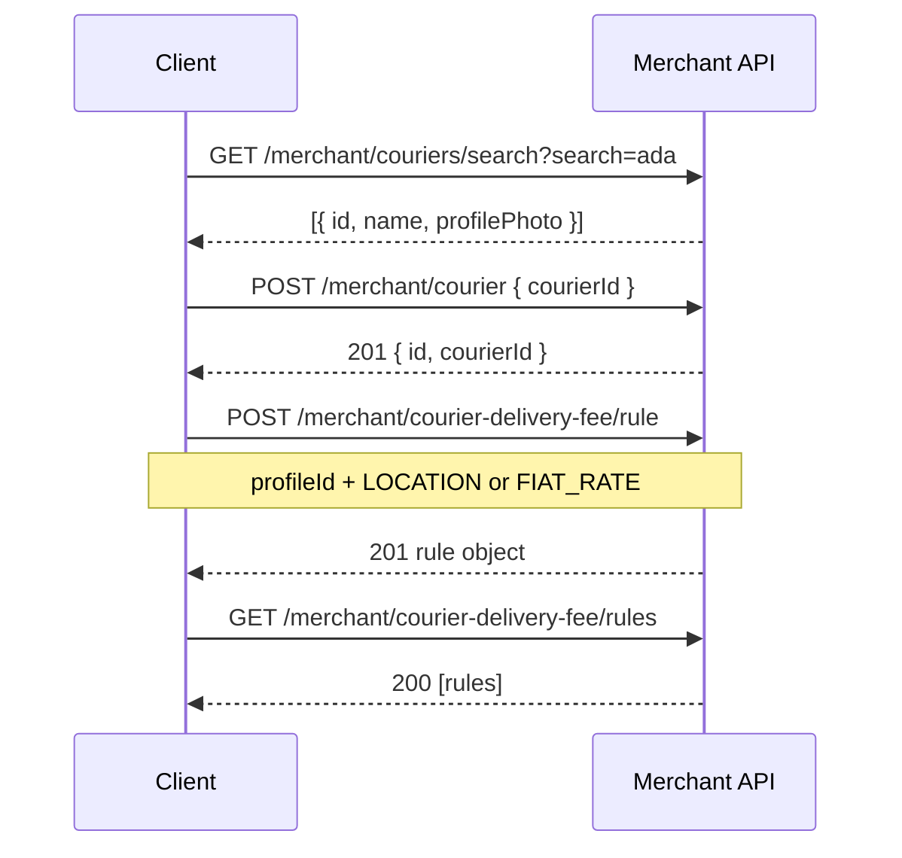

# Merchant API

Base path: **`/merchant`** · Hosts: staging **`https://staging-api.waysdrop.com`**, live **`https://api.waysdrop.com`**

All routes use **`ApiKeyJWTAuthGuard`** + **`UserGuard`**.

---

## Authentication

Send **one** of:

| Method  | Header          | Value                                         |
| ------- | --------------- | --------------------------------------------- |
| API key | `api-key`       | `wsp_live_<64 hex>` or `wsp_staging_<64 hex>` |
| JWT     | `Authorization` | `Bearer <access_token>`                       |

The authenticated user must be **active** (not banned). API-key auth resolves the merchant user from the key record.

**Store-only operations:** `POST /merchant/courier` and `DELETE /merchant/couriers/:courierId` require an **active Store profile** (`type: Store`, `status: ACTIVE`, `active: true`). Otherwise:

```json
{
  "statusCode": 403,
  "method": "POST",
  "timestamp": "2026-05-15T12:00:00.000Z",
  "path": "/merchant/courier",
  "url": "https://api.example.com/merchant/courier",
  "message": "Active store profile required",
  "details": { "error": "Forbidden", "statusCode": 403 },
  "environment": "production"
}
```

---

## Response envelopes

### Success (JSON body)

```json
{
  "success": true,
  "message": "<human-readable message>",
  "data": <payload or omitted>
}
```

### Success (no body)

**`204 No Content`** — empty body (used for deletes).

### Errors

Nest exceptions use this shape (via `SentryExceptionFilter`):

```json
{
  "statusCode": 400,
  "method": "GET",
  "timestamp": "2026-05-15T12:00:00.000Z",
  "path": "/merchant/couriers/search",
  "url": "https://api.example.com/merchant/couriers/search?limit=foo",
  "message": "Validation failed message(s); joined with '; '",
  "details": { "error": "Bad Request", "statusCode": 400 },
  "environment": "production"
}
```

**Quota exceeded (API key, `429`):** `message` may be an object with `quota` (`limit`, `remaining`, `resetAt`, `resetIn`).

---

## Endpoints overview

| #   | Method   | Path                                      | Purpose                                 |
| --- | -------- | ----------------------------------------- | --------------------------------------- |
| 1   | `POST`   | `/merchant/courier`                       | Add courier to merchant list            |
| 2   | `DELETE` | `/merchant/couriers/:courierId`           | Remove courier from list                |
| 3   | `GET`    | `/merchant/couriers/specific`             | List merchant's saved couriers          |
| 4   | `GET`    | `/merchant/couriers/search`               | Search platform couriers                |
| 5   | `GET`    | `/merchant/locations`                     | Location autocomplete / catalog         |
| 6   | `POST`   | `/merchant/courier-delivery-fee/rule`     | Create/update courier delivery fee rule |
| 7   | `GET`    | `/merchant/courier-delivery-fee/rules`    | List courier delivery fee rules         |
| 8   | `DELETE` | `/merchant/courier-delivery-fee/rule/:id` | Delete a pricing rule                   |

---

## 1. Add courier to merchant list

**`POST /merchant/courier`**

### Request body

| Field       | Type | Required | Description                                  |
| ----------- | ---- | -------- | -------------------------------------------- |
| `courierId` | UUID | Yes      | Active, identity-verified courier profile ID |

```json
{
  "courierId": "787db687-d0d9-425a-955e-aa52d6572da9"
}
```

### Success — `201 Created`

```json
{
  "success": true,
  "message": "Courier added successfully",
  "data": {
    "id": "a1b2c3d4-e5f6-7890-abcd-ef1234567890",
    "courierId": "787db687-d0d9-425a-955e-aa52d6572da9"
  }
}
```

- `id` — `merchant_specific_couriers` row ID
- `courierId` — courier profile ID

If the courier was previously removed (soft-deleted link), the same row is restored.

### Errors

| Status | Message (typical)                            |
| ------ | -------------------------------------------- |
| `403`  | Active store profile required                |
| `404`  | Courier not found                            |
| `409`  | Courier is already on your list              |
| `400`  | Validation (invalid UUID, empty body field)  |
| `401`  | Authentication required / invalid key or JWT |

### Sample — conflict

```json
{
  "statusCode": 409,
  "method": "POST",
  "timestamp": "2026-05-15T12:00:00.000Z",
  "path": "/merchant/courier",
  "url": "https://api.example.com/merchant/courier",
  "message": "Courier is already on your list",
  "details": { "error": "Conflict", "statusCode": 409 },
  "environment": "production"
}
```

---

## 2. Remove courier from merchant list

**`DELETE /merchant/couriers/:courierId`**

### Path params

| Param       | Type | Description                  |
| ----------- | ---- | ---------------------------- |
| `courierId` | UUID | Courier profile ID to remove |

### Success — `204 No Content`

No response body.

### Errors

| Status | Message (typical)             |
| ------ | ----------------------------- |
| `403`  | Active store profile required |
| `404`  | Courier is not on your list   |
| `400`  | Invalid UUID in path          |

---

## 3. Fetch merchant-specific couriers

**`GET /merchant/couriers/specific`**

### Query params

| Param    | Type   | Required | Description                                                                   |
| -------- | ------ | -------- | ----------------------------------------------------------------------------- |
| `search` | string | No       | Case-insensitive match on courier name, email, phone, or linked user fullname |

Example: `GET /merchant/couriers/specific?search=john`

### Success — `200 OK`

`data` is an **array** of:

| Field          | Type           | Description                       |
| -------------- | -------------- | --------------------------------- |
| `id`           | UUID           | Merchant–courier link ID          |
| `courierId`    | UUID           | Courier profile ID                |
| `profilePhoto` | string \| null | Profile image URL                 |
| `phone`        | string \| null | Courier phone, else user phone    |
| `totalReviews` | number         | Count of non-deleted reviews      |
| `email`        | string \| null | Courier email, else user email    |
| `name`         | string \| null | Courier name, else user fullname  |
| `avgRating`    | number         | Average rating; `0` if no reviews |

### Sample — multiple couriers

```json
{
  "success": true,
  "message": "Merchant specific couriers fetched successfully",
  "data": [
    {
      "id": "msc-1111-2222-3333-444455556666",
      "courierId": "787db687-d0d9-425a-955e-aa52d6572da9",
      "profilePhoto": "https://cdn.example.com/photos/courier-1.jpg",
      "phone": "+2348012345678",
      "totalReviews": 42,
      "email": "courier1@example.com",
      "name": "Ada Courier",
      "avgRating": 4.7
    },
    {
      "id": "msc-aaaa-bbbb-cccc-dddddddddddd",
      "courierId": "898ec798-e1ea-536b-a66f-bb63e7683eb0",
      "profilePhoto": null,
      "phone": "+2348098765432",
      "totalReviews": 0,
      "email": null,
      "name": "Ben Rider",
      "avgRating": 0
    }
  ]
}
```

### Sample — empty list

```json
{
  "success": true,
  "message": "Merchant specific couriers fetched successfully",
  "data": []
}
```

---

## 4. Search couriers (platform)

**`GET /merchant/couriers/search`**

Used to discover couriers before adding them. Does **not** require an active store profile.

### Query params

| Param    | Type    | Required | Default | Description                                                       |
| -------- | ------- | -------- | ------- | ----------------------------------------------------------------- |
| `search` | string  | No       | —       | Matches name, email, or `phoneWithCountryCode` (case-insensitive) |
| `limit`  | integer | No       | `100`   | Max results                                                       |

Example: `GET /merchant/couriers/search?search=ada&limit=20`

Only returns couriers where:

- `type = Courier`, `status = ACTIVE`
- Linked user has `identityVerified = true`

Results are ordered by **average rating** (desc), then limited.

### Success — `200 OK`

`data` is an **array** of:

| Field          | Type           | Description                                         |
| -------------- | -------------- | --------------------------------------------------- |
| `id`           | UUID           | Courier profile ID (use as `courierId` when adding) |
| `profilePhoto` | string \| null | Profile image URL                                   |
| `name`         | string \| null | Profile name or user fullname                       |

### Sample — search with results

```json
{
  "success": true,
  "message": "Couriers fetched successfully",
  "data": [
    {
      "id": "787db687-d0d9-425a-955e-aa52d6572da9",
      "profilePhoto": "https://cdn.example.com/photos/courier-1.jpg",
      "name": "Ada Courier"
    },
    {
      "id": "898ec798-e1ea-536b-a66f-bb63e7683eb0",
      "profilePhoto": null,
      "name": "Ada Okafor"
    }
  ]
}
```

### Sample — no matches

```json
{
  "success": true,
  "message": "Couriers fetched successfully",
  "data": []
}
```

---

## 5. Fetch locations

**`GET /merchant/locations`**

Location autocomplete for routes, pricing `from`/`to`, etc.

### Query params

| Param    | Type    | Required | Default | Description                   |
| -------- | ------- | -------- | ------- | ----------------------------- |
| `search` | string  | No       | `""`    | Search text                   |
| `type`   | enum    | No       | —       | Route granularity (see below) |
| `limit`  | integer | No       | `50`    | Max results                   |

**`type` values** (`RouteType`):

| Value                       | Behavior                                                            |
| --------------------------- | ------------------------------------------------------------------- |
| _(omitted)_ or `INTER_CITY` | Indexed system locations (cities/LGAs)                              |
| `INTER_STATE`               | State-level route catalog                                           |
| `INTER_COUNTRY`             | Country-level options                                               |
| `INTER_CONTINENT`           | Continent-level options                                             |
| `INTER_REGION`              | Operational region catalog (deprecated enum value, still supported) |

### Response shape

`data` is an **array**. Items are either:

**A) System location** (`INTER_CITY` / no `type`) — `SystemLocation` + `value`:

| Field                                     | Type           | Notes                                                                        |
| ----------------------------------------- | -------------- | ---------------------------------------------------------------------------- |
| `value`                                   | string         | `googlePlaceId` or `locationId` — use as stable picker value                 |
| `locationId`                              | string         | Internal location ID                                                         |
| `country`, `countryCode`                  | string         |                                                                              |
| `lat`, `lon`                              | number         |                                                                              |
| `lgaOrCity`, `state`, `zoneOrDistrict`, … | string \| null | Address/geo fields from catalog                                              |
| _(other)_                                 |                | Many optional `Address`-like fields (`adminUnitName`, `googlePlaceId`, etc.) |

**B) Route location option** (when `type` is set and not plain `INTER_CITY`) — includes:

| Field          | Type        | Notes                                                                          |
| -------------- | ----------- | ------------------------------------------------------------------------------ |
| `value`        | string      | Route-specific identifier                                                      |
| `name`         | string      | Display label                                                                  |
| `type`         | `RouteType` | Echoes requested granularity                                                   |
| _(geo fields)_ |             | e.g. `state`, `country`, `countryCode`, `continentCode`, … depending on `type` |

### Sample — `INTER_CITY` search

`GET /merchant/locations?search=ikeja&limit=5`

```json
{
  "success": true,
  "message": "Locations fetched successfully",
  "data": [
    {
      "locationId": "ng-lagos-ikeja",
      "value": "ChIJxxxxxxxx",
      "country": "Nigeria",
      "countryCode": "NG",
      "lat": 6.6018,
      "lon": 3.3515,
      "lgaOrCity": "Ikeja",
      "state": "Lagos",
      "adminUnitName": "Ikeja",
      "googlePlaceId": "ChIJxxxxxxxx"
    }
  ]
}
```

### Sample — `INTER_STATE` catalog slice

`GET /merchant/locations?type=INTER_STATE&search=lag&limit=3`

```json
{
  "success": true,
  "message": "Locations fetched successfully",
  "data": [
    {
      "value": "ng-admin1-lagos",
      "name": "Lagos",
      "type": "INTER_STATE",
      "state": "Lagos",
      "country": "Nigeria",
      "countryCode": "NG",
      "continentCode": "AF",
      "continentName": "Africa",
      "admin1Id": "ng-admin1-lagos",
      "admin1Name": "Lagos"
    }
  ]
}
```

### Sample — `INTER_COUNTRY`

`GET /merchant/locations?type=INTER_COUNTRY&limit=2`

```json
{
  "success": true,
  "message": "Locations fetched successfully",
  "data": [
    {
      "value": "NG",
      "name": "Nigeria",
      "type": "INTER_COUNTRY",
      "country": "Nigeria",
      "countryCode": "NG",
      "countryCodeAlpha3": "NGA",
      "continentCode": "AF",
      "continentName": "Africa"
    }
  ]
}
```

---

## 6. Upsert courier delivery fee pricing rule

**`POST /merchant/courier-delivery-fee/rule`**

Creates or updates a **`ProfileDeliveryFeePricingRule`** for the authenticated merchant’s **courier** profiles (or merchant-wide courier rules). **Store** profiles use the store dashboard instead: **`POST /store/delivery-fee/rule`** (same body shape; `profileId` is injected from the store session; **`merchantId` is not allowed** on store rules).

### Request body

| Field            | Type       | Required       | Description                                            |
| ---------------- | ---------- | -------------- | ------------------------------------------------------ |
| `id`             | UUID       | No             | If present, **update** existing rule                   |
| `profileId`      | UUID       | No             | Courier profile ID; omit for **merchant-wide** rules   |
| `capBy`          | enum       | **Yes**        | `LOCATION` or `FIAT_RATE`                              |
| `from`           | string     | If `LOCATION`  | Origin label (e.g. `"Lagos"`)                          |
| `to`             | string     | If `LOCATION`  | Destination label (e.g. `"Oyo"`)                       |
| `withinKmRadius` | number ≥ 0 | If `FIAT_RATE` | Distance band in km                                    |
| `rate`           | number ≥ 0 | No             | Fee amount (`Decimal` in DB; often returned as string) |
| `isPerKg`        | boolean    | No             | Default `false` — rate applies per kg when `true`      |

**Rules:**

- **`LOCATION`:** `from` + `to` required; `withinKmRadius` **not** allowed. Duplicate normalized `from`/`to` for same scope → `409`.
- **`FIAT_RATE`:** `withinKmRadius` required; `from`/`to` **not** allowed. Duplicate radius for same scope → `409`.
- **Courier-specific rule:** set `profileId` **and** courier must already be on the merchant list (`POST /merchant/courier`). Otherwise `404` with message about adding the courier on the merchant dashboard first.
- **Merchant-wide rule:** omit `profileId`; only `merchantId` (injected) is used.

### Sample request — location-based (per route)

```json
{
  "capBy": "LOCATION",
  "from": "Lagos",
  "to": "Ibadan",
  "rate": 5500,
  "isPerKg": false
}
```

### Sample request — fiat rate (distance band)

```json
{
  "capBy": "FIAT_RATE",
  "withinKmRadius": 25,
  "rate": 1200,
  "isPerKg": true
}
```

### Sample request — courier-specific + update

```json
{
  "id": "rule-uuid-here",
  "profileId": "787db687-d0d9-425a-955e-aa52d6572da9",
  "capBy": "LOCATION",
  "from": "Lagos",
  "to": "Abuja",
  "rate": 8000
}
```

### Success — `201 Created`

`data` is the Prisma `ProfileDeliveryFeePricingRule` record:

| Field            | Type                      | Description                           |
| ---------------- | ------------------------- | ------------------------------------- |
| `id`             | UUID                      | Rule ID                               |
| `capBy`          | `LOCATION` \| `FIAT_RATE` |                                       |
| `rate`           | string \| null            | Decimal serialized (e.g. `"5500.00"`) |
| `from`           | string \| null            | Set for `LOCATION`                    |
| `to`             | string \| null            | Set for `LOCATION`                    |
| `isPerKg`        | boolean                   |                                       |
| `withinKmRadius` | number \| null            | Set for `FIAT_RATE`                   |
| `profileId`      | UUID \| null              | Courier profile if scoped             |
| `merchantId`     | UUID \| null              | Merchant user ID                      |
| `createdAt`      | ISO datetime              |                                       |
| `updatedAt`      | ISO datetime              |                                       |
| `deletedAt`      | null                      | Active rules                          |

### Sample — `LOCATION` rule created

```json
{
  "success": true,
  "message": "Courier delivery fee pricing rule saved successfully",
  "data": {
    "id": "f47ac10b-58cc-4372-a567-0e02b2c3d479",
    "capBy": "LOCATION",
    "rate": "5500",
    "from": "Lagos",
    "to": "Ibadan",
    "isPerKg": false,
    "withinKmRadius": null,
    "profileId": null,
    "merchantId": "merchant-user-uuid",
    "createdAt": "2026-05-15T10:00:00.000Z",
    "updatedAt": "2026-05-15T10:00:00.000Z",
    "deletedAt": null
  }
}
```

### Sample — `FIAT_RATE` rule created

```json
{
  "success": true,
  "message": "Courier delivery fee pricing rule saved successfully",
  "data": {
    "id": "a1b2c3d4-e5f6-7890-abcd-ef1234567890",
    "capBy": "FIAT_RATE",
    "rate": "1200",
    "from": null,
    "to": null,
    "isPerKg": true,
    "withinKmRadius": 25,
    "profileId": "787db687-d0d9-425a-955e-aa52d6572da9",
    "merchantId": "merchant-user-uuid",
    "createdAt": "2026-05-15T10:05:00.000Z",
    "updatedAt": "2026-05-15T10:05:00.000Z",
    "deletedAt": null
  }
}
```

### Common errors

| Status | Message (examples)                                               |
| ------ | ---------------------------------------------------------------- |
| `400`  | `withinKmRadius is required for FIAT_RATE courier fee rules`     |
| `400`  | `from and to are not allowed for FIAT_RATE courier fee rules`    |
| `400`  | `withinKmRadius is not allowed for LOCATION courier fee rules`   |
| `400`  | `Profile is not a courier`                                       |
| `404`  | `Merchant specific courier not found. Please add the courier...` |
| `404`  | `Rule not found` (bad `id` on update)                            |
| `409`  | `Courier route pricing rule already exists`                      |
| `409`  | `Courier fiat rule with this withinKmRadius already exists`      |

---

## 7. List courier delivery fee pricing rules

**`GET /merchant/courier-delivery-fee/rules`**

`merchantId` is injected from the authenticated user.

### Query params

| Param       | Type | Required | Description                          |
| ----------- | ---- | -------- | ------------------------------------ |
| `profileId` | UUID | No       | Filter rules for one courier profile |

Examples:

- All merchant rules: `GET /merchant/courier-delivery-fee/rules`
- One courier: `GET /merchant/courier-delivery-fee/rules?profileId=787db687-d0d9-425a-955e-aa52d6572da9`

### Success — `200 OK`

`data` is an **array** of rule objects (same shape as upsert response), ordered by `updatedAt` desc, then `createdAt` desc.

### Sample — mixed rule types

```json
{
  "success": true,
  "message": "Courier delivery fee pricing rules retrieved successfully",
  "data": [
    {
      "id": "rule-fiat-001",
      "capBy": "FIAT_RATE",
      "rate": "1200",
      "from": null,
      "to": null,
      "isPerKg": true,
      "withinKmRadius": 25,
      "profileId": "787db687-d0d9-425a-955e-aa52d6572da9",
      "merchantId": "merchant-user-uuid",
      "createdAt": "2026-05-10T08:00:00.000Z",
      "updatedAt": "2026-05-15T10:05:00.000Z",
      "deletedAt": null
    },
    {
      "id": "rule-loc-002",
      "capBy": "LOCATION",
      "rate": "5500",
      "from": "Lagos",
      "to": "Ibadan",
      "isPerKg": false,
      "withinKmRadius": null,
      "profileId": null,
      "merchantId": "merchant-user-uuid",
      "createdAt": "2026-05-01T08:00:00.000Z",
      "updatedAt": "2026-05-01T08:00:00.000Z",
      "deletedAt": null
    }
  ]
}
```

### Sample — empty

```json
{
  "success": true,
  "message": "Courier delivery fee pricing rules retrieved successfully",
  "data": []
}
```

---

## 8. Delete courier delivery fee pricing rule

**`DELETE /merchant/courier-delivery-fee/rule/:id`**

### Path params

| Param | Type | Description     |
| ----- | ---- | --------------- |
| `id`  | UUID | Pricing rule ID |

### Success — `204 No Content`

No body.

### Errors

| Status | Message        |
| ------ | -------------- |
| `404`  | Rule not found |
| `400`  | Invalid UUID   |

---

## Recommended client flows



1. **Onboard courier:** `GET /couriers/search` → `POST /courier`
2. **Configure fees:** `POST /courier-delivery-fee/rule` (optionally after `GET /locations` for `from`/`to` labels)
3. **Manage list:** `GET /couriers/specific` → `DELETE /couriers/:courierId` when needed

---

## Enums reference

```ts
// RouteType (locations query)
'INTER_CITY' |
  'INTER_STATE' |
  'INTER_REGION' |
  'INTER_COUNTRY' |
  'INTER_CONTINENT';

// ProfileDeliveryFeePricingType (pricing body)
'LOCATION' | 'FIAT_RATE';
```

---

## Related docs

- `docs/delivery-fee-integration-guide.md` — store checkout pricing stack, split, promos, ₦1,500 floor
- `docs/pricing-management-system-guide.md` — admin pricing system and store order flow
- `docs/delivery-route-system-guide.md` — route types and location catalogs
